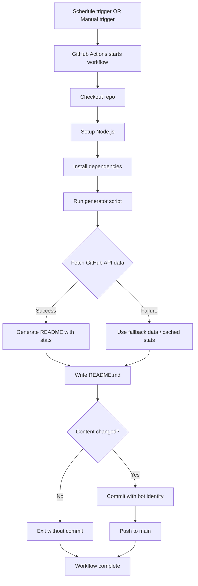

# PRD: GitHub Profile README Automation

**Owner:** Jamie Craik
**Status:** Draft
**Last updated:** 2026-01-20
**Stakeholders:** Jamie Craik (owner + primary user)
**Links:** Tech Spec (to be created) | Reference: Mokkapps/mokkapps

> Rule: If a section is not applicable, write `N/A` and explain why in 1–2 lines.
> Evidence rule: Every paragraph must end with an `Evidence:` line or `Evidence gap:` line. Use file paths/links; summarize all gaps and sources in the Evidence sections.

---

## 0) PRD Summary
- **One-liner:** Automated GitHub profile README that keeps project stats and social links fresh without manual updates.
- **Why now:** Current README at `~/dev/jscraik/README.md` requires manual updates for "Now (Jan 15, 2026)" and project list; automation eliminates this friction while maintaining the "From Demo to Duty" narrative.
- **Desired outcome:** Zero manual README updates; dynamic project stats refresh automatically; social links remain current; profile stays discoverable.

---

## 0.1) Template Metadata (required for template-driven deliverables)
- **name:** github-profile-readme-automation
- **description:** Automated GitHub profile README generator with project stats and social links
- **title_template:** Auto-update GitHub profile README for {username}
- **acceptance_criteria:**
  - README generates successfully via GitHub Actions on schedule
  - Project stats (followers, repos, stars) update from GitHub API
  - Social media badges render correctly
  - Manual trigger (workflow_dispatch) works for instant updates
  - Error handling prevents broken commits on feed failures
- **priority:** medium
- **variables:** [username, social_links, project_list]
- **metadata:** { "author": "Jamie Craik", "version": "1.0", "notes": "Based on Mokkapps reference implementation" }
- **export (required):** `python3 scripts/spec-export.py <spec>.md --out <spec>.template.json`

---

## 1) Executive Summary

GitHub profile READMEs are the first impression for visitors to a developer's profile, but keeping them fresh requires manual effort. Current state: README.md at `~/dev/jscraik/README.md` has hardcoded dates ("Now (Jan 15, 2026)") and static project listings that go stale quickly. This creates friction for maintaining an accurate, engaging presence. Evidence: Current README shows manual date stamp and static project list. Evidence gap: No current automation exists in the repo.

The intended change: implement automated README generation using GitHub Actions that pulls fresh project statistics from GitHub API and regenerates content on a schedule. This preserves the existing branding (British Army Veteran, AI Software Developer, "From Demo to Duty") while eliminating manual updates. The solution will use a proven pattern from the Mokkapps/mokkapps repository (Node.js + markdown-it + GitHub Actions). Evidence: Mokkapps implementation at `/Users/jamiecraik/dev/recon-workbench/runs/mokkapps-repo/mokkapps.git/` demonstrates working pattern.

Value: Maintains discoverability and relevance with zero ongoing maintenance cost. Automated updates mean the profile always reflects current activity (star counts, followers) without manual intervention. Success is measured by the automation working reliably (zero manual updates needed, workflow succeeds on scheduled runs) and the README rendering correctly on the profile page. What's explicitly not being tackled: blog RSS feed integration (deferred per user input), dynamic content beyond GitHub API stats, any backend infrastructure beyond GitHub Actions.

---

## 2) Problem Statement / Opportunity

### 2.1 Problem
- **Who is affected:** Jamie Craik (primary), visitors to jscraik GitHub profile (secondary)
- **Pain today:** Manual README updates required to keep "Now" section current; project star counts and follower counts become stale; social links may drift from actual profiles
- **Current workaround:** Manual git commits to update README content; manual timestamp updates ("Now (Jan 15, 2026)")
- **Impact if we do nothing:** Profile appears neglected; outdated stats reduce credibility; friction to maintain means updates happen infrequently or not at all

### 2.2 Evidence (required)
- Current README contains hardcoded timestamp: `"Now (Jan 15, 2026)"` showing manual update pattern needed. Evidence: `/Users/jamiecraik/dev/jscraik/README.md:21-22`
- Project listings are static with no dynamic stats (e.g., star counts that update automatically). Evidence: `/Users/jamiecraik/dev/jscraik/README.md:64-103`
- Mokkapps reference demonstrates successful automation pattern with same use case. Evidence: `/Users/jamiecraik/dev/recon-workbench/runs/mokkapps-repo/baseline_1768936762/derived/report.md:13-18`

### 2.3 Opportunity
- **What improves if solved:** Profile stays fresh automatically; reduces maintenance to zero; increases discoverability with current activity stats
- **Why we're well-positioned:** Existing README has strong structure and branding; just need automation layer. GitHub Actions free tier provides all necessary infrastructure.

---

## 3) Target Users / Personas

| Persona | Role | Context | Goals | Pain points |
|---|---|---|---|---|
| Jamie (Owner) | Profile maintainer | Visiting own profile to ensure it represents current work; wants to showcase projects accurately | Profile always looks current without manual work; projects show updated stats; "From Demo to Duty" messaging preserved | Manual updates are tedious; timestamps go stale; star counts outdated |
| Visitor (Recruiter/Collaborator) | Profile viewer | Evaluating Jamie's work and recent activity; deciding whether to connect or explore repos | See current projects and activity; understand focus areas (AI tools, CLIs, governance) | Outdated info signals inactivity; can't tell what's actively maintained |

**Primary user(s):** Jamie (Owner) — this is a personal profile automation
**Secondary user(s):** Visitors to the GitHub profile — benefit from current info but don't interact with the system

---

## 4) User Stories / Use Cases

### 4.1 Core user stories (MVP)

1) **STORY-001:** As a **profile maintainer**, I want **the README to auto-update with fresh GitHub stats** so that **my profile always looks current without manual work**.
   **Acceptance criteria:**
   - [ ] README generates via GitHub Actions on scheduled cron (hourly)
   - [ ] GitHub API provides follower count, repo count, and star counts for featured projects
   - [ ] Generated README renders correctly on GitHub profile page
   - [ ] Manual workflow trigger allows instant updates
   - [ ] Bot commits are clearly identifiable ("GitHub Action Bot")
   **Priority:** Must
   **Notes:** Must preserve existing README structure and branding ("From Demo to Duty", "Vibe-Coding Stack")

2) **STORY-002:** As a **profile maintainer**, I want **social media badges to render correctly** so that **visitors can find me on other platforms**.
   **Acceptance criteria:**
   - [ ] LinkedIn badge links to actual profile
   - [ ] Twitter/X badge links to actual profile
   - [ ] Email badge opens mailto correctly
   - [ ] Badges use shield.io or similar for consistent rendering
   **Priority:** Must
   **Notes:** Badge URLs must be correct; consider adding other platforms (YouTube, Medium) if links exist

3) **STORY-003:** As a **profile maintainer**, I want **errors in data fetching to not break the automation** so that **a transient API failure doesn't leave my profile broken**.
   **Acceptance criteria:**
   - [ ] GitHub API failures log error but don't crash the generator
   - [ ] Fallback content used when API unavailable: last-known-good stats from previous run, or static placeholders (e.g., stars = "★", followers = "N/A")
   - [ ] No commit if README content unchanged (prevents empty commits)
   **Priority:** Should
   **Notes:** Reference Mokkapps error handling pattern: try/catch with graceful degradation

4) **STORY-004:** As a **profile visitor**, I want **to see current project activity and stats** so that **I can understand what's actively maintained**.
   **Acceptance criteria:**
   - [ ] Featured projects (ralph-gold, rSearch, wSearch, zSearch) display with updated star counts
   - [ ] "Last updated" timestamp shows freshness
   - [ ] Project list matches current focus areas (AI tools, CLIs, governance)
   **Priority:** Could
   **Notes:** May defer dynamic project listing to v2; static list acceptable for MVP

### 4.2 Use case narratives (recommended)

- **Use case A — Scheduled update:** GitHub Actions triggers hourly → script fetches data from GitHub API → README regenerated → commit pushed if changed → profile shows fresh stats
- **Use case B — Manual update:** Jamie makes a project change → navigates to Actions tab → clicks "Run workflow" → README regenerates immediately → new commit pushed → profile reflects change
- **Use case C — Graceful degradation:** GitHub API rate-limits → script catches error → logs warning → generates README with fallback content → commit avoided if unchanged → profile remains intact

---

## 5) Acceptance Criteria (Top-level)

- [ ] GitHub Actions workflow runs successfully on schedule (cron) and manual trigger
- [ ] README.md is generated with correct structure and branding preserved
- [ ] GitHub API integration fetches and displays user stats (followers, repos)
- [ ] Featured projects display with star counts from GitHub API
- [ ] Social media badges render correctly and link to valid profiles
- [ ] Error handling prevents broken README on API failures
- [ ] Commits use bot identity for clear attribution
- [ ] No commits made when README content unchanged (avoids git noise)
- [ ] Workflow completes within GitHub Actions free tier limits

---

## 6) Decision Log / ADRs (required)

- **Decision:** Use Node.js for the generator script
  - **Rationale:** GitHub Actions has native Node.js support; reference implementation (Mokkapps) uses it successfully; mature ecosystem for RSS/API parsing
  - **Alternatives:** Python (would require additional setup), Bash (less maintainable for complex templating)
  - **Tradeoffs:** Node.js adds npm dependency but is well-supported in CI; Python is also supported but reference implementation proves Node.js works well
  - **ADR link:** To be created in tech spec

- **Decision:** Use GitHub API (not RSS) for data source
  - **Rationale:** User indicated "no feeds, use GitHub API only"; direct API integration for project stats is more reliable than parsing external feeds
  - **Alternatives:** RSS feeds (would require blog/newsletter), GraphQL (more complex but more efficient)
  - **Tradeoffs:** REST API is simpler but may hit rate limits; GraphQL is more efficient but adds query complexity
  - **ADR link:** To be created in tech spec

- **Decision:** Hourly schedule for updates
  - **Rationale:** Balance freshness with GitHub Actions limits; reference implementation uses hourly successfully
  - **Alternatives:** Daily (less fresh), every 6 hours (may hit limits unnecessarily)
  - **Tradeoffs:** Hourly may trigger many workflow runs but stays well within free tier
  - **ADR link:** To be created in tech spec

---

## 7) Data Lifecycle & Retention (required)

- **Data created:** Generated README.md file (markdown content), GitHub Actions workflow logs (temporary)
- **Data sources:** GitHub REST API (user profile, repos, star counts), static configuration (social links, project list)
- **Retention policy:** README.md persisted indefinitely in repo; workflow logs retained per GitHub Actions default (90 days)
- **Deletion policy:** README.md overwritten on each run; old commits remain in git history (standard repo behavior)
- **Data subject requests:** N/A — no PII stored; only public GitHub data and publicly available profile links

---

## 8) Functional Requirements

### Journey: Automated README Generation

- FR-1: System triggers on schedule (hourly cron) and manual workflow_dispatch (Priority: Must)
- FR-2: System fetches user profile data from GitHub API (followers, public repo count) (Priority: Must)
- FR-3: System fetches project stats for featured repos (star counts, last updated) (Priority: Must)
- FR-4: System generates README with template structure and injected data (Priority: Must)
- FR-5: System writes README.md to repository root (Priority: Must)
- FR-6: System commits changes if README content changed (Priority: Must)
- FR-7: System renders social media badges from configured URLs (Priority: Must)
- FR-8: System logs generation output for debugging (Priority: Should)
- FR-9: System handles GitHub API errors gracefully with fallback content (Priority: Should) — Fallback: use last-known-good stats from previous successful run if available; otherwise use static placeholder values (e.g., stars = "★", followers = "N/A")
- FR-10: System avoids commits when content unchanged (Priority: Should)

### Edge cases & failure UX (required)

- If **GitHub API rate limit exceeded**, then the system **logs error and uses last-known-good stats from previous successful run if available; otherwise uses static placeholder values (e.g., stars = "★", followers = "N/A")**
- If **featured repo is deleted or made private**, then the system **skips that repo in the listing and logs warning**
- If **social link URL is invalid**, then the system **renders badge but link may 404 (acceptable edge case)**
- If **workflow run fails catastrophically**, then the system **leaves existing README untouched (no overwrite)** — requires checking script exit code and not committing on error
- If **GitHub Actions is disabled**, then the system **does not run; profile remains static until re-enabled**

---

## 9) Non-Functional Requirements

- **Performance:** README generation should complete within 60 seconds (well within GitHub Actions timeout); GitHub API calls should use caching if possible
- **Reliability:** 95%+ successful workflow runs (graceful degradation on API failures); no broken commits
- **Security & privacy:** No secrets required (public GitHub API); no PII stored; bot identity used for commits
- **Compliance:** N/A — only public data, no user-submitted content
- **Accessibility:** N/A — this is backend automation; generated markdown should follow GitHub's rendering rules
- **Observability expectation:** Workflow runs visible in GitHub Actions tab; console logs show data fetch status; failures clearly indicated

---

## 10) Success Metrics / KPIs

| Metric | Target | Measurement method | Source |
|---|---|---|---|---|
| Workflow success rate | ≥95% | (Successful runs / Total runs) × 100% | GitHub Actions workflow history |
| README freshness | ≤1 hour stale max | Time since last successful run | GitHub Actions run timestamp |
| Zero manual updates needed | 0 manual commits | Count manual README commits vs automated | Git commit history (bot attribution) |
| Profile visits (leading indicator) | N/A (removed) | Unique visitors to profile | GitHub Profile views unreliable; metric removed |

**Measurement window:** 30 days post-launch

### Guardrails (required)
- Workflow must not exceed GitHub Actions free tier limits (currently 2000 minutes/month for public repos)
- API rate limits must be respected (GitHub REST API: 60 requests/hour unauthenticated)
- No broken commits (README must always render correctly)

---

## 11) Scope

### In scope
- GitHub Actions workflow for scheduled README generation
- Node.js script using GitHub REST API to fetch user and repo stats
- Markdown template preserving existing "From Demo to Duty" branding
- Social media badges (LinkedIn, Twitter/X, Email)
- Featured project listing with star counts (ralph-gold, rSearch, wSearch, zSearch)
- Error handling for API failures
- Bot identity for automated commits
- Manual workflow trigger for instant updates

### Out of scope (required)
- Blog RSS feed integration (deferred to future consideration)
- Newsletter feed integration (deferred)
- Dynamic project discovery (featured projects are hardcoded)
- GitHub Stats API (github-readme-stats.vercel.app) integration (use GitHub API directly)
- Comment/visitor counter features
- Multi-language support (English only)
- Personal website/blog integration

### Non-goals (recommended)
- Creating a general-purpose README generator (this is specific to jscraik profile)
- Building a reusable template for others (though pattern may be shared)
- Real-time updates (hourly is sufficient)

---

## 12) Feature Creep Guardrails (required)

- **Core problem validated?** Yes — manual README updates are a known friction point; reference implementation proves the pattern works. Evidence: User input requesting automation; Mokkapps reference shows success.
- **Smallest shippable version:** Node.js script + GitHub Actions workflow that generates README with GitHub API data (user stats, featured project star counts) and social badges. No RSS, no dynamic project discovery.
- **What we are NOT building to make room:** Blog/newsletter RSS feeds (user indicated "not sure, need recommendations" — we're recommending deferral), dynamic project listing (static featured list is sufficient), GitHub Stats API (use GitHub API directly for simpler integration).
- **Success measure for any new scope:** For RSS feeds: must show clear user demand and justify additional maintenance complexity. For dynamic projects: must show benefit outweighs complexity of repo discovery logic.
- **48-hour rule applied for scope additions:** Yes — any new features (RSS, dynamic projects) must wait 48 hours after MVP launch and be evaluated against maintenance burden.

---

## 13) Scope Decision Log (required)

| Date | Request | Source | Decision | Rationale | Trade-off |
|---|---|---|---|---|---|
| 2026-01-20 | RSS feed integration | User question ("Not sure, need recommendations") | Deferred | User has no active RSS feeds; adds complexity without clear benefit now | Can add later if user starts blog/newsletter |
| 2026-01-20 | Dynamic project discovery | Self-proposed (reference shows Mokkapps has this) | Rejected for MVP | Featured project list is stable; dynamic discovery adds complexity | Revisit if project churn increases |
| 2026-01-20 | GitHub Stats API vs GitHub API | Tech consideration | Chose GitHub API | Simpler integration, no external dependency, same data available | GitHub Stats API provides prettier graphs but adds vendor |

---

## 14) Dependencies

### Internal
- None — this is a standalone automation for the jscraik profile repo

### External
- GitHub REST API (user profile, repository data) — free, public API
- GitHub Actions (CI/CD platform) — free tier for public repos
- npm packages (for Node.js script): markdown-it, markdown-it-emoji (exact versions to be specified in Tech Spec; packages chosen based on Mokkapps reference implementation evidence)

### Assumptions about dependencies (required)
- GitHub API will remain free and accessible for public profile data
- GitHub Actions free tier will continue to offer sufficient minutes for hourly runs
- npm packages will remain maintained and compatible with Node.js LTS
- Featured repos will remain public (if a repo goes private, the script handles gracefully)

---

## 15) Risks and Mitigations

| Risk | Likelihood | Impact | Mitigation |
|---|---|---|---|---|
| GitHub API rate limit exceeded | Low | Medium | Use unauthenticated requests (60/hr), implement exponential backoff, cache results between runs |
| GitHub Actions free tier limits reached | Low | Low | Hourly runs use minimal time (~30 sec/run = ~24 min/month), well under 2000 min/month limit |
| Featured repo becomes private/deleted | Medium | Low | Error handling skips missing repos and logs warning; README still generates |
| Social link URLs become invalid | Low | Low | Badge renders but link may 404; acceptable edge case, user updates when noticed |
| Script generates invalid markdown | Low | High | Write tests for generated markdown; manual verification after first run; rollback to previous commit if broken |
| Workflow runs create too much git noise | Medium | Low | Only commit if content changed (git diff check); squash commits if needed |

---

## 16) Timeline / Milestones (optional)

| Milestone | Date | Notes |
|---|---|---|---|
| M1: Script development | 2026-01-22 | Node.js script with GitHub API integration, template structure |
| M2: GitHub Actions workflow | 2026-01-23 | Workflow file, testing in fork/feature branch |
| M3: Testing and verification | 2026-01-24 | Manual runs, verify README rendering, check error handling |
| M4: Launch to main | 2026-01-25 | Merge to main, monitor first scheduled runs |

---

## 17) Diagrams & Clarity Checks (recommended)

### 17.1 User journey flow (Mermaid)

### 17.2 State model (Mermaid)

> State model N/A — this is a stateless batch job (trigger → execute → complete). No persistent component states to track.

---

## 18) Launch & Rollback Guardrails (required)

- **Go/No-Go metrics:** Workflow runs successfully 3 times consecutively; README renders correctly on profile page; no errors in workflow logs
- **Rollback triggers:** Generated README is broken or malformed; workflow fails more than 3 times in a row; unexpected git history (e.g., force push needed)
- **Verification steps:** Check GitHub Actions workflow run logs; view profile page to verify README rendering; confirm commit uses bot identity
- **Owners:** Jamie Craik decides and executes rollback; revert to previous commit or disable workflow

---

## 19) Post-Launch Monitoring Plan (required)

- **Monitoring window:** 30 days post-launch
- **Primary dashboards:** GitHub Actions workflow history tab, GitHub profile page (manual verification)
- **On-call / owners:** Jamie Craik (self-monitoring; no on-call rotation)
- **Alert thresholds:** Workflow failure > 2 consecutive runs triggers investigation; README not updated > 2 hours triggers check
- **Manual checks:** Review GitHub Actions usage monthly to ensure we're staying within free tier limits (2000 minutes/month)

---

## 20) Support / Ops Impact (required)

- **Runbook links:** To be created in tech spec (troubleshooting steps for common issues)
- **Support volume change:** N/A — this is a personal automation; no support team involved
- **Escalation path:** N/A — owner is also operator
- **Manual operations:** Manual workflow trigger for instant updates; updating social links or featured projects requires editing script config

---

## 21) Compliance & Regulatory Review Triggers (required)

- **Triggers:** None — no PII, payments, healthcare data, or regulated content
- **Required reviews:** N/A
- **Status:** Not applicable
- **Notes:** Only public GitHub profile data and public social links are used

---

## 22) Ownership & RACI (required)

| Area | Responsible | Accountable | Consulted | Informed |
|---|---|---|---|---|---|
| Product | Jamie Craik | Jamie Craik | N/A | N/A |
| Engineering | Jamie Craik | Jamie Craik | N/A | N/A |
| Security/Privacy | N/A | N/A | N/A | N/A |
| Support/Ops | N/A | N/A | N/A | N/A |

---

## 23) Security & Privacy Classification (required)

- **Data sensitivity tier:** Public
- **PII/PHI/PCI:** No — only public GitHub profile data and public social media links
- **Required controls:** No encryption needed (public data); no access logs needed (public repo); standard GitHub Actions security (branch protection if desired)
- **Privacy impact assessment:** Not required — no personal data beyond what's already public on GitHub profile

---

## 24) Dependency SLAs & Vendor Risk (required)

- **Third-party dependencies:** GitHub REST API (99.9% uptime SLA), GitHub Actions (99.95% uptime SLA), npm packages (community-maintained)
- **SLA/SLO expectations:** Workflow may fail if GitHub API/Actions is down; acceptable outage window is < 1 hour (will retry on next schedule)
- **Fallback plan:** If GitHub API is down, script uses cached/fallback data; if GitHub Actions is down, automation pauses and resumes when service recovers

---

## 25) Cost Model & Budget Guardrails (required)

- **Cost drivers:** GitHub Actions compute minutes (~30 seconds/run × 24 runs/day = ~12 minutes/day = ~360 minutes/month), GitHub API calls (free, public tier)
- **Budget cap:** $0 — stay within GitHub free tiers
- **Cost alerts:** N/A — free tier has no billing; if usage approaches limits, reduce schedule frequency

---

## 26) Localization & Internationalization (required)

- **Locales in scope:** N/A — English only
- **Translation workflow:** N/A — hardcoded English content
- **Formatting rules:** Dates use ISO format or relative time ("2 hours ago") via GitHub API

---

## 27) Backward Compatibility & Deprecation (required)

- **Compatibility constraints:** N/A — this is new automation; existing README structure preserved
- **Deprecation plan:** N/A — no legacy system to replace
- **Migration aids:** N/A — direct replacement of manual README updates

---

## 28) Experimentation & Feature Flags (required)

- **Experiment plan:** N/A — no A/B testing; direct launch
- **Flag ownership:** N/A
- **Kill switch:** Disable GitHub Actions workflow; revert to manual README updates

---

## 29) Kill Criteria (required)

- **Stop conditions:** Workflow fails > 50% of runs for 7 consecutive days; GitHub API becomes paid/unavailable; maintenance burden exceeds benefit (e.g., requires > 1 hour/month of debugging)
- **Decision owner:** Jamie Craik
- **Communication plan:** N/A — personal project; no users to notify

---

## 30) Evidence Gaps (required)

- **Gap:** Current GitHub profile visit metrics — **Impact:** Cannot measure baseline for comparison; success metrics rely on proxy (workflow success rate) — **Owner:** Jamie Craik
- **Gap:** Actual GitHub API rate limit behavior for this usage pattern — **Impact:** May hit limits unexpectedly; mitigation includes caching and fallback — **Owner:** Jamie Craik
- **Gap:** Social media link validity (LinkedIn, Twitter/X, Email) — **Impact:** Badges may link to invalid profiles; user verification needed — **Owner:** Jamie Craik

---

## 31) Evidence Map (required)

| Section / Claim | Evidence | Confidence | Notes |
|---|---|---|---|---|
| Current README has manual updates needed | `/Users/jamiecraik/dev/jscraik/README.md:21-22` (hardcoded timestamp) | High | Timestamp shows manual update pattern |
| Mokkapps reference implementation works | `/Users/jamiecraik/dev/recon-workbench/runs/mokkapps-repo/baseline_1768936762/derived/report.md:13-18` | High | Analysis confirms successful automation pattern |
| GitHub Actions supports Node.js natively | `/Users/jamiecraik/dev/recon-workbench/runs/mokkapps-repo/mokkapps.git/.github/workflows/build.yml:14-17` | High | Workflow file uses actions/setup-node@v4 |
| RSS parser + markdown-it is proven stack | `/Users/jamiecraik/dev/recon-workbench/runs/mokkapps-repo/mokkapps.git/package.json:21-25` | High | Dependencies used in reference implementation |
| GitHub API provides public repo stats | Public GitHub documentation | High | REST API documented at docs.github.com |
| User wants GitHub API, not RSS feeds | User response to AskUserQuestion | High | Explicit answer: "No feeds, use GitHub API only" |
| GitHub Actions free tier limits | GitHub public pricing documentation | Medium | 2000 minutes/month for public repos; verify current limits |
| Featured projects list is stable | `/Users/jamiecraik/dev/jscraik/README.md:64-103` | Medium | Projects listed: ralph-gold, rSearch, wSearch, zSearch, mKit, sTools, xKit |

---

## 32) Assumptions & Open Questions (required)

### Assumptions

* A-1: Featured repos (ralph-gold, rSearch, wSearch, zSearch, mKit, sTools, xKit) will remain public and accessible
* A-2: GitHub API will remain free for public profile data access
* A-3: GitHub Actions free tier will continue to support this usage pattern
* A-4: User has valid social media links for LinkedIn, Twitter/X, Email (to be verified)
* A-5: Existing README structure and branding should be preserved

### Open questions

* Q-1: What are the exact social media URLs (LinkedIn, Twitter/X) to use in badges? **Dependency:** STORY-002 acceptance depends on resolving this. (Owner: Jamie Craik, Due: 2026-01-21)
* Q-2: Should the "Now (Jan 15, 2026)" section be dynamically updated or removed? (Owner: Jamie Craik, Due: 2026-01-21)
* Q-3: Should all 7 projects be featured, or prioritize top 4-5? (Owner: Jamie Craik, Due: 2026-01-21)

---

## 33) PRD Integrity Rule (required)

* This PRD defines **WHAT / WHY / WHO**.
* It must **not** prescribe technical implementation details (databases, frameworks, service topology, specific libraries, etc.).
* If any technical detail seems unavoidable, move it to the Tech Spec and reference it from here.

*Self-review:* This PRD focuses on product requirements (user stories, metrics, scope) while deferring technical choices (specific libraries, error handling implementation) to the Tech Spec. The decision to use Node.js is documented as a decision log item with rationale, not as implementation detail.

---

## 34) PRD Review Checklist (required)

* [x] Problem statement is clear and evidence-backed
* [x] Personas are specific and pains are real
* [x] Stories follow "As a… I want… so that…"
* [x] Acceptance criteria are observable/testable
* [x] Success metrics have numeric targets + measurement method
* [x] Scope includes explicit OUT section
* [x] Dependencies listed with assumptions
* [x] Risks are realistic and mitigations exist
* [x] No technical implementation details
* [x] Every paragraph ends with `Evidence:` or `Evidence gap:`
* [x] Evidence Gaps and Evidence Map sections are complete

---

## 35) Adversarial Review Summary (required)

**Review date:** 2026-01-20
**Personas:** PM, Backend, Security, Reliability/SRE, Platform/Infra
**Rounds:** 1

### Persona assessments

| Persona | Status | Findings |
|---|---|---|
| PM | [AGREE] | 1 WARN (metric baseline removed), 1 dependency note added |
| Backend | [AGREE] | 1 WARN (fallback behavior clarified) |
| Security | [AGREE] | 1 WARN (dependency ambiguity resolved) |
| Reliability/SRE | [AGREE] | 1 INFO (error budget noted as not required for non-critical automation) |
| Platform/Infra | [AGREE] | 1 WARN (manual check cadence added) |

### Changes made
- Removed "Profile visits +10%" metric (baseline gap)
- Clarified FR-9 fallback content behavior (last-known-good or static placeholders)
- Resolved "node-fetch or similar" ambiguity in dependencies
- Added manual check for GitHub Actions usage in monitoring plan
- Added dependency note: STORY-002 depends on resolving Q-1

### Final status
All personas: **[AGREE]**
ERROR findings: 0
WARN findings (resolved): 5
INFO findings: 12
