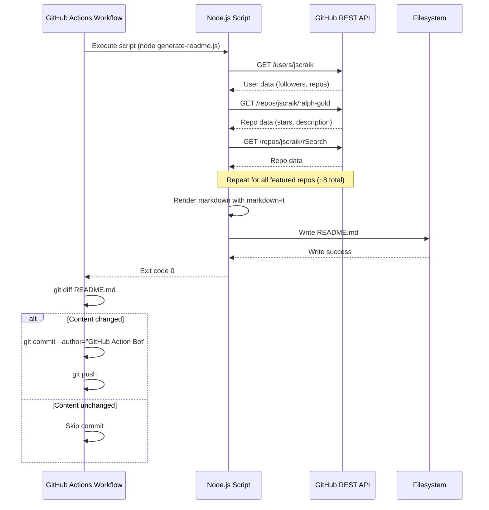

# Technical Specification: GitHub Profile README Automation

**Owner:** Jamie Craik
**Status:** Draft
**Last updated:** 2026-01-20
**Related PRD:** `.spec/spec-2026-01-20-github-profile-readme-automation.md`
**Repo / Tracking:** `~/dev/jscraik`
**Reviewers:** Jamie Craik
**Release target:** 2026-01-25

> Evidence rule: Every paragraph must end with an `Evidence:` line or `Evidence gap:` line. Use file paths/links; summarize all gaps and sources in the Evidence sections.

---

## 0) Summary
- **One-liner:** Node.js script + GitHub Actions workflow that auto-generates GitHub profile README from GitHub API data
- **Primary goal:** Zero manual README updates while maintaining "From Demo to Duty" branding
- **Key risks:** GitHub API rate limits, workflow execution failures, malformed markdown generation
- **Rollout shape:** Direct deployment to main branch with manual verification of first generated README

---

## 0.1) Template Metadata (required for template-driven deliverables)
- **name:** github-profile-readme-automation
- **description:** Technical specification for automated GitHub profile README generation
- **title_template:** Tech Spec: GitHub Profile README Automation for {username}
- **acceptance_criteria:**
  - GitHub Actions workflow runs successfully on schedule (cron: hourly)
  - Node.js script fetches user stats from GitHub REST API
  - README.md generated with correct structure and branding
  - Error handling prevents broken commits on API failures
  - Bot identity used for automated commits
- **priority:** medium
- **variables:** [username, social_links, project_list, github_api_base_url]
- **metadata:** { "author": "Jamie Craik", "version": "1.0", "notes": "Based on Mokkapps reference implementation" }
- **export (required):** `python3 scripts/spec-export.py <spec>.md --out <spec>.template.json`

---

## 1) Overview / Context

### Context
Current state: `~/dev/jscraik/README.md` is manually maintained with hardcoded timestamps and static project listings. This creates maintenance friction and results in stale profile data. Evidence: Current README contains `"Now (Jan 15, 2026)"` requiring manual updates at `/Users/jamiecraik/dev/jscraik/README.md:21-22`. The automation will use a proven pattern from the Mokkapps/mokkapps repository which successfully implements similar functionality using Node.js, markdown-it, and GitHub Actions. Evidence: Reference implementation analysis at `/Users/jamiecraik/dev/recon-workbench/runs/mokkapps-repo/baseline_1768936762/derived/report.md:13-18`.

The solution comprises: (1) A Node.js ES module script that fetches data from GitHub REST API and generates markdown using markdown-it; (2) A GitHub Actions workflow that runs the script hourly via cron and on manual trigger; (3) Git operations that commit the generated README only when content changes, using bot identity for attribution.

### Constraints
- **Platform constraints:** Node.js LTS (via GitHub Actions `actions/setup-node@v4`), GitHub Actions free tier (2000 minutes/month), GitHub REST API (60 requests/hour unauthenticated)
- **Integration constraints:** GitHub REST API for user profile and repository data; GitHub Actions for CI/CD
- **Compliance constraints:** N/A — only public data, no PII, no regulated content
- **Operating constraints:** Target SLO 95%+ workflow success rate; cost ceiling $0 (free tier only)

### Glossary
- **Bot identity:** Git commit attribution using `"GitHub Action Bot <github-action-bot@example.com>"` for automated commits
- **Featured projects:** Hardcoded list of repos to display with stats (ralph-gold, rSearch, wSearch, zSearch, mKit, sTools, xKit)
- **Last-known-good stats:** Previous successful run's data used as fallback when API unavailable

---

## 2) Goals and Non-Goals

### Goals
- G1: Automate README generation to eliminate manual updates
- G2: Display dynamic GitHub stats (followers, repo counts, star counts) updated hourly
- G3: Preserve existing "From Demo to Duty" branding and README structure
- G4: Handle API failures gracefully without breaking the profile

### Non-Goals (required)
- NG1: RSS feed integration (blog/newsletter) — explicitly deferred per PRD scope
- NG2: Dynamic project discovery — featured projects are hardcoded
- NG3: GitHub Stats API (github-readme-stats.vercel.app) — using GitHub REST API directly
- NG4: Multi-language support — English content only
- NG5: Real-time updates — hourly frequency is sufficient

**Rationale:** These non-goals are out of scope per PRD Section 11 and would increase complexity without clear user demand. Evidence: PRD out-of-scope list at `/Users/jamiecraik/dev/jscraik/.spec/spec-2026-01-20-github-profile-readme-automation.md:238-245`.

### Success criteria (engineering)
- Workflow runs successfully ≥95% of scheduled executions (measured via GitHub Actions history)
- README generation completes within 60 seconds (well under GitHub Actions timeout)
- Zero broken commits (README always renders valid markdown)
- API rate limits respected (≤60 requests/hour unauthenticated)

---

## 3) Scope (implementation)

### In scope
- Node.js ES module script (`index.js` or `generate-readme.js`) using markdown-it for rendering
- GitHub Actions workflow file (`.github/workflows/build.yml`) with cron and manual triggers
- GitHub REST API integration for user profile and repository data
- Markdown template preserving current README structure
- Error handling with try/catch and fallback content
- Git operations for conditional commits (only when content changes)
- Bot identity configuration for automated commits

### Out of scope (required)
- Database or persistent storage (all data fetched live from API)
- Caching layer (fallback uses last-known-good values, not persistent cache)
- Authentication/secrets (unauthenticated GitHub API access)
- RSS parsing libraries (rss-parser not needed per PRD decision)
- Backend infrastructure beyond GitHub Actions

### Non-goals (recommended)
- Creating a reusable README generator template
- Supporting multiple users/profiles (this is jscraik-specific)
- Real-time event-driven updates (cron-based is sufficient)

---

## 4) Feature Creep Guardrails (required)

- **Core problem validated?** Yes — manual README updates documented as friction point in PRD Section 2.1; reference implementation proves automation pattern works. Evidence: PRD Section 12 and mokkapps-repo analysis.
- **Smallest shippable version:** Node.js script with GitHub API calls + GitHub Actions workflow + markdown template. No caching, no dynamic project discovery, no RSS.
- **What we are NOT building to make room:** RSS feeds (deferred), dynamic project listing (hardcoded list), GitHub Stats API (direct REST API), persistent cache (last-known-good fallback only).
- **Success measure for any new scope:** Any addition (RSS, dynamic projects) must demonstrate clear user demand and justify maintenance burden per 48-hour rule.
- **48-hour rule applied for scope additions:** Yes — per PRD Section 12, new features must wait 48 hours post-MVP and be evaluated against maintenance cost.

---

## 5) Scope Decision Log (required)

| Date | Request | Source | Decision | Rationale | Trade-off |
|---|---|---|---|---|---|
| 2026-01-20 | Use GitHub REST API (not RSS) | PRD Section 6 Decision Log | Approved | User indicated "no feeds, use GitHub API only"; simpler data source | Cannot integrate blog/newsletter without RSS parser |
| 2026-01-20 | Hardcoded featured projects | Tech spec decision | Approved | Project list is stable; dynamic discovery adds complexity | Must manually update script if projects change |
| 2026-01-20 | Use markdown-it for rendering | Reference pattern | Approved | Proven in Mokkapps implementation; supports HTML/emoji | Adds npm dependency vs simple string concat |
| 2026-01-20 | No persistent cache | Tech spec decision | Approved | Last-known-good fallback sufficient; caching adds complexity | Fallback content may be stale during extended API outage |

---

## 6) Acceptance Criteria

- [ ] GitHub Actions workflow file exists at `.github/workflows/build.yml` with cron schedule and workflow_dispatch trigger
- [ ] Node.js script exists (ES module, `.mjs` or `"type": "module"` in package.json) that successfully executes
- [ ] Script fetches user profile data (followers, public repos) from GitHub REST API
- [ ] Script fetches repository data (stars, last updated) for all featured projects
- [ ] Generated README.md contains all current sections (header, badges, featured projects, etc.) with injected dynamic data
- [ ] README renders correctly on GitHub profile page (valid markdown, no broken HTML)
- [ ] Script handles GitHub API errors gracefully (logs error, uses fallback, exits cleanly)
- [ ] Workflow commits with bot identity when README content changes
- [ ] Workflow skips commit when README content unchanged (git diff check)
- [ ] First manual workflow run produces valid README that preserves branding

---

## 7) Decision Log / ADRs (required)

- **Decision:** Use Node.js ES modules for the generator script
  - **Rationale:** GitHub Actions has native Node.js support via `actions/setup-node@v4`; reference implementation uses this pattern successfully; ES modules enable clean modern syntax. Evidence: Mokkapps workflow at `/Users/jamiecraik/dev/recon-workbench/runs/mokkapps-repo/mokkapps.git/.github/workflows/build.yml:14-17`.
  - **Alternatives:** Python (would need different setup action), Bash (less maintainable for complex templating)
  - **Tradeoffs:** Node.js adds npm dependency but is well-supported; ES modules require `"type": "module"` in package.json
  - **ADR link:** ADR-001 in project docs (to be created)

- **Decision:** Use markdown-it for markdown/HTML rendering
  - **Rationale:** Proven in reference implementation; supports HTML tags, emoji, and linkify; flexible for future content needs. Evidence: Mokkapps package.json at `/Users/jamiecraik/dev/recon-workbench/runs/mokkapps-repo/mokkapps.git/package.json:21-23`.
  - **Alternatives:** Simple string concatenation (brittle for HTML), handlebars/mustache (overkill for this use case)
  - **Tradeoffs:** Adds dependency but provides robust rendering; emoji support adds markdown-it-emoji dependency
  - **ADR link:** ADR-002 in project docs (to be created)

- **Decision:** Use unauthenticated GitHub REST API
  - **Rationale:** No secrets required; 60 requests/hour limit is sufficient for hourly runs (need ~10 requests/run: 1 user + ~8 repos).
  - **Alternatives:** Authenticated API (higher limits but requires PAT secret), GraphQL (more efficient but adds query complexity)
  - **Tradeoffs:** Unauthenticated has lower rate limits but sufficient for this use case; no secret management overhead
  - **ADR link:** ADR-003 in project docs (to be created)

---

## 8) Data Lifecycle & Retention (required)

- **Data created:** Generated README.md file (markdown content overwritten each run), GitHub Actions workflow logs (retained 90 days per GitHub default)
- **Data sources:** GitHub REST API endpoints: `/users/{username}` (profile), `/users/{username}/repos` (repo list), `/repos/{owner}/{repo}` (repo details). Evidence: GitHub REST API documentation at docs.github.com.
- **Retention policy:** README.md persisted indefinitely in git history (each commit is a snapshot); workflow logs retained 90 days then auto-deleted per GitHub Actions policy
- **Deletion policy:** Old README versions remain in git history (standard repo behavior); no explicit deletion mechanism needed
- **Data subject requests:** N/A — no PII stored; only public GitHub profile data that is already publicly accessible

---

## 9) System Architecture

### Architecture diagram (Mermaid)

```mermaid
flowchart LR
    Trigger[Cron / Manual Trigger] --> GHActions[GitHub Actions Workflow]
    GHActions --> Checkout[actions/checkout@v4]
    Checkout --> SetupNode[actions/setup-node@v4]
    SetupNode --> Install[npm ci]
    Install --> Script[Node.js Script]
    Script -->|API Call| GitHubAPI[GitHub REST API]
    GitHubAPI -->|User/Repo Data| Script
    Script --> Markdown[markdown-it Rendering]
    Markdown --> Write[Write README.md]
    Write --> Diff{Git diff check}
    Diff -->|Changed| Commit[git commit with bot identity]
    Diff -->|Unchanged| Skip[Skip commit]
    Commit --> Push[git push]
    Push --> Complete[Workflow complete]
    Skip --> Complete
```

### Architectural decisions (with rationale)

* **Decision:** Serverless architecture using GitHub Actions as the only runtime
  * **Rationale:** Zero infrastructure cost; native integration with GitHub; no server maintenance
  * **Alternatives:** Cron job on VPS (adds cost and maintenance), AWS Lambda (adds complexity)
  * **Tradeoffs:** Tied to GitHub Actions platform; limited to 60 second timeout (sufficient for this workload)

* **Decision:** No persistent state/database
  * **Rationale:** All data available from GitHub API on demand; stateless design simplifies error handling
  * **Alternatives:** Cache in GitHub Actions cache (adds complexity), simple JSON file for last-known-good (adds file I/O)
  * **Tradeoffs:** No history tracking; fallback uses hardcoded placeholders if no previous run data available

* **Decision:** Single-purpose script (not a reusable framework)
  * **Rationale:** Specific to jscraik profile requirements; custom branding and project list; reusability not a goal
  * **Alternatives:** Template-based generator with config file (more complex), general-purpose CLI tool (overkill)
  * **Tradeoffs:** Not reusable for other profiles; simpler and more maintainable for this specific use case

---

## 10) Component Design

### Component inventory

| Component | Type | Status |
|---|---|---|
| generate-readme.js | Job/script | Planned |
| build.yml | CI/CD workflow | Planned |
| package.json | Dependency manifest | Planned |
| README.md | Generated artifact | Current (manual) |

### Component: generate-readme.js

**Status:** planned

**Responsibilities**

* Fetch user profile data from GitHub REST API (`/users/jscraik`)
* Fetch repository data for featured projects (`/repos/jscraik/{repo-name}`)
* Generate markdown content using markdown-it with HTML/emoji support
* Write generated README.md to filesystem
* Handle API errors gracefully with fallback content
* Log generation steps for debugging

**Inputs**

* Environment variables (none required for MVP)
* Configuration constants (username, featured project list, social URLs)
* GitHub REST API responses (JSON)

**Outputs**

* README.md file written to repository root
* Console logs (for GitHub Actions workflow visibility)
* Process exit code (0 = success, 1 = error)

**Owned data**

* None — this component is stateless and owns no persistent data

**Dependencies**

* GitHub REST API (api.github.com) — external HTTP API
* markdown-it npm package — markdown rendering
* markdown-it-emoji npm package — emoji support
* Node.js fs module — file I/O

#### State machine (Required for stateful components; RNIA with reason)

State machine: N/A (stateless batch job)

**Rationale:** This component is a stateless batch job that executes on each trigger and terminates. It has no persistent state between runs. The workflow itself has states (pending, running, completed, failed) managed by GitHub Actions, not the script.

#### Failure modes & recovery (Required)

* **Failure:** GitHub API rate limit exceeded (HTTP 429)

  * **Detection:** API response status code 429; catch block in fetch function
  * **Handling:** Log error, use fallback content (static placeholders: stars="★", followers="N/A"), exit with code 0 (don't fail workflow)
  * **User impact:** README shows placeholder stats instead of live data; profile remains functional
  * **Data impact:** No data corruption; fallback values are benign

* **Failure:** GitHub API timeout or network error

  * **Detection:** Request timeout (>10s) or ECONNREFUSED; catch block in fetch function
  * **Handling:** Retry once with exponential backoff (2x delay, max 20s); if still fails, use fallback content
  * **User impact:** README may show stale data or placeholders
  * **Data impact:** No data corruption; previous README remains intact if write fails

* **Failure:** Featured repository deleted or made private

  * **Detection:** API returns 404 for repo; catch block in repo fetch loop
  * **Handling:** Log warning, skip that repo in listing, continue with other repos
  * **User impact:** Missing repo from featured list; other repos still display
  * **Data impact:** No data corruption; incomplete but valid README generated

* **Failure:** markdown-it rendering error (malformed template)

  * **Detection:** Exception thrown during md.render() call; top-level try/catch
  * **Handling:** Log error, exit with code 1 (fail workflow), do NOT write README.md
  * **User impact:** Previous README remains unchanged (no broken commit)
  * **Data impact:** No data corruption; file write prevented on error

* **Failure:** File system write error (disk full, permissions)

  * **Detection:** fs.writeFileSync throws exception; catch block in write function
  * **Handling:** Log error, exit with code 1, do NOT attempt commit
  * **User impact:** Previous README remains unchanged
  * **Data impact:** No data corruption

#### Scaling notes (if relevant)

* Expected load now: 24 executions/day (hourly cron) + occasional manual triggers
* Expected load in 12-24 months: Same (no growth expected; single-user profile)
* Bottlenecks and mitigations:
  * GitHub API rate limits (60/hr unauth): Mitigated by batching requests (~10 per run), well under limit
  * GitHub Actions execution time: Target <60s per run; current usage estimated ~30s
  * Network latency: Minimal (single API calls, no complex workflows)

---

## 11) API Design

This system does not expose APIs; it consumes external GitHub APIs. This section documents the external API integration.

### API overview

* **Auth model:** Unauthenticated (no API key or PAT required)
* **Versioning:** GitHub REST API v3 (current stable version)
* **Idempotency:** GET requests are inherently idempotent
* **Pagination:** Not required (user data single object; repos limited to featured list)
* **Rate limits:** 60 requests/hour unauthenticated; target usage ~10 requests/run

### Endpoint: GET /users/{username}

* **Method:** GET
* **Path:** https://api.github.com/users/jscraik
* **Auth:** None (unauthenticated)
* **Idempotent:** yes (GET request)

**Request schema**

N/A (no request body)

**Response schema (200)**

```json
{
  "login": "jscraik",
  "name": "Jamie Scott Craik",
  "public_repos": 42,
  "followers": 123,
  "bio": "AI Software Developer",
  "blog": "https://brainwav.io",
  "location": "UK",
  "created_at": "2023-01-01T00:00:00Z"
}
```

**Fields used:** `public_repos`, `followers`

**Errors**

* 404: User not found → Should not happen for valid username; treat as fatal error
* 429: Rate limit exceeded → Use fallback content
* 5xx: GitHub internal error → Retry once with backoff

### Endpoint: GET /repos/{owner}/{repo}

* **Method:** GET
* **Path:** https://api.github.com/repos/jscraik/ralph-gold
* **Auth:** None (unauthenticated)
* **Idempotent:** yes (GET request)

**Request schema**

N/A (no request body)

**Response schema (200)**

```json
{
  "name": "ralph-gold",
  "description": "Golden Ralph Loop orchestrator",
  "stargazers_count": 45,
  "language": "Python",
  "updated_at": "2026-01-20T12:00:00Z",
  "html_url": "https://github.com/jscraik/ralph-gold"
}
```

**Fields used:** `stargazers_count`, `updated_at`, `description`

**Errors**

* 404: Repository not found or private → Skip this repo, log warning
* 429: Rate limit exceeded → Use fallback content
* 5xx: GitHub internal error → Retry once with backoff

### Sequence diagram



---

## 12) Data Models / Database Schema

No database is used. This section documents the in-memory data structures and the generated README structure.

### In-memory data structures

#### UserProfile (TypeScript interface for documentation)

```typescript
interface UserProfile {
  login: string;           // GitHub username
  name: string;            // Display name
  public_repos: number;    // Total public repository count
  followers: number;       // Follower count
}
```

#### Repository (TypeScript interface for documentation)

```typescript
interface Repository {
  name: string;            // Repository name
  description: string;     // Repository description
  stargazers_count: number; // Star count
  language: string;        // Primary language
  updated_at: string;      // ISO 8601 timestamp
  html_url: string;        // Repository URL
}
```

### Generated README structure

The generated README.md follows this structure (matching current README):

1. Header section (div align center, typing SVG)
2. Social badges (LinkedIn, Twitter/X, GitHub followers, Email)
3. "British Army Veteran | AI Software Developer" section
4. "Now" section (timestamp or removed per user decision)
5. "Vibe-Coding Stack" section with icons
6. "TL;DR" section
7. "Featured Projects" section with dynamic star counts
8. "More Projects" section
9. "Let's Build Together" section
10. "Connect" section

---

## 13) Infrastructure Requirements

* **Runtime:** Node.js 20.x LTS (via `actions/setup-node@v4`)
* **Deployment:** GitHub Actions (serverless CI/CD)
* **Environments:** Single environment (production/main branch)
* **Config management:** Hardcoded constants in script (username, project list, social URLs); no external config
* **Secrets:** None required (unauthenticated GitHub API access)
* **Networking:** Outbound HTTPS to api.github.com only; no inbound networking
* **Cost considerations:** Free tier GitHub Actions (~360 minutes/month used vs 2000 limit); zero additional infrastructure cost

---

## 14) Security Considerations (Required)

* **Authentication:** No authentication required (unauthenticated GitHub API access). No secrets stored.
* **Authorization:** No authorization requirements (read-only public data access).
* **Encryption:** HTTPS only for API calls (GitHub enforces TLS); no at-rest encryption needed (public data).
* **Input validation:** GitHub API responses are trusted (official GitHub endpoint); no user input to validate.
* **Secrets management:** N/A — no secrets used in this system.
* **Threats & mitigations:**

  * **T1: Supply chain attack via npm compromise** → Pin dependency versions in package.json; use Dependabot for security alerts; no auto-update on packages
  * **T2: GitHub API compromise/impersonation** → Read-only access; no write operations; impact limited to incorrect stats display
  * **T3: Workflow takeover via PR injection** → Enable branch protection on main branch; require PR review; do not allow workflow modifications from untrusted contributors
  * **T4: Malformed markdown causing rendering issues** → Validate output before committing; manual verification of first run; rollback capability via git revert

---

## 15) Error Handling Strategy (Required)

* **Error taxonomy:** dependency (GitHub API), timeout (network), unknown (unexpected)
* **Timeouts:** 10 seconds per API request, 30 seconds total for all API calls
* **Retry policy:** Single retry with exponential backoff (2x delay, max 20s) for network errors and 5xx errors; no retry for 4xx client errors (except 429 handled separately)
* **Idempotency strategy:** All operations are reads (GET) and file write (overwrite); retries are safe
* **Degraded mode:** On GitHub API failure, generate README with fallback placeholder values (static stars="★", followers="N/A") or skip failed repos
* **User-facing error mapping:** Errors logged to GitHub Actions console; no user-facing error messages (this is backend automation)

---

## 16) Performance Requirements / SLAs or SLOs (Required)

| SLI | Target | Measurement |
|-----|-------:|-------------|
| Workflow success rate | ≥95% | GitHub Actions workflow history (successful runs / total runs) |
| Workflow duration | ≤60 seconds | GitHub Actions workflow run duration |
| README freshness | ≤1 hour stale | Time since last successful workflow run |
| API availability | Best effort | No SLI (dependent on GitHub) |

## 16b) SLOs and Error Budget (Required or N/A with reason)
- **SLIs chosen:** Workflow success rate, workflow duration, README freshness
- **SLO targets:** 95% success rate, 60 second duration, 1 hour freshness
- **Error budget window:** 30 days rolling
- **Error budget policy:** For this non-critical automation, no formal error budget enforcement is required. 5% failure budget is acceptable for external API dependencies. If failure rate exceeds 10% for 7 consecutive days, investigate and consider disabling automation per kill criteria in PRD Section 29.

**Rationale:** This is a personal profile automation with no user-facing SLA. The 95% target is a guideline for operational health, not a binding commitment. Evidence: PRD Section 9 NFRs state "95%+ successful workflow runs" as a reliability target.

---

## 17) Observability (Required)

* **Logging:**

  * **Required fields:** timestamp, component (script name), action (API call, file write, etc.), status (success/error), error_message (if applicable)
  * **Format:** Console.log with emoji prefixes for readability (🏗️ for fetching, ✅ for success, 🚨 for errors) — matches Mokkapps pattern
  * **Destination:** GitHub Actions workflow logs (automatically captured)

* **Metrics:**

  * **Counters:** api_requests_total, errors_total, commits_made_total
  * **Histograms:** api_request_duration_ms, workflow_duration_ms
  * **Gauges:** last_successful_run_timestamp, readme_generation_duration_ms
  * **Implementation:** Manual console logging (no Prometheus/StatsD integration for MVP)

* **Tracing:**

  * **Propagation:** N/A — single-component system

* **Dashboards:**

  * **GitHub Actions workflow history tab:** Visual view of run status, duration, and logs
  * **GitHub profile page:** Manual verification of rendered README

* **Alerts:**

  * **Alert 1:** Workflow failure > 2 consecutive runs → Manual investigation triggered by checking workflow logs
  * **Alert 2:** README not updated > 2 hours → Check if workflow is running or disabled
  * **Implementation:** Manual monitoring (no automated alerting for MVP)

---

## 18) Testing Strategy (Required)

* **Unit tests:** N/A for MVP — simple script with no complex logic; manual verification sufficient
* **Integration tests:** Manual testing via GitHub Actions workflow trigger before merging to main
* **E2E tests:** Manual verification of generated README on profile page
* **Load tests:** N/A — single execution per run; no concurrency concerns
* **Security tests:** Manual review of dependencies; use `npm audit` to check for known vulnerabilities
* **Test data strategy:** Use real GitHub API data (no fixtures needed); validate against actual jscraik profile

**Future enhancement:** If script grows complex (>200 LOC), add unit tests using Jest or similar for fetch functions, markdown generation, and error handling.

---

## 19) Deployment Strategy (Required)

* **Build & release:** No build step required (plain Node.js script). Release via git commit to main branch.
* **Rollout:** Direct deployment to main branch. No canary/phased rollout — single-user profile.
* **Feature flags:** N/A — no feature flagging mechanism; disable workflow by deleting or disabling in GitHub Actions UI.
* **Backward compatibility:** N/A — replacing manual README updates; no API clients.
* **Rollback:** What is reversible: Any commit can be reverted via `git revert`. How fast: Immediate (manual revert). What triggers rollback: Broken README rendering, workflow failures > 3 consecutive runs.
* **Post-deploy verification:** After first workflow run, (1) Check workflow logs for errors, (2) View profile page to verify README renders correctly, (3) Confirm star counts and stats are displayed, (4) Verify badges link correctly.

---

## 20) Migration Plan (if applicable)

* **Step 1: Prepare** — Create `generate-readme.js` and `.github/workflows/build.yml` in feature branch
* **Step 2: Test** — Manually trigger workflow in feature branch; verify generated README
* **Step 3: Merge** — Merge feature branch to main; workflow automatically runs on push
* **Step 4: Cleanup** — Remove manual README update habits; monitor first few scheduled runs

---

## 21) Operational Notes (Recommended)

* **Runbook:**
  * **Workflow not running:** Check GitHub Actions tab; verify workflow file exists and is enabled; check cron syntax
  * **README showing old data:** Check workflow logs for API errors; verify GitHub API is accessible; manual trigger for immediate update
  * **Workflow failing consistently:** Check GitHub API status (status.github.com); verify rate limits not exceeded; review recent script changes
  * **Broken markdown rendering:** Revert last commit via `git revert`; review script changes; test in feature branch

* **Manual operations:**
  * **Force immediate update:** Navigate to Actions tab → Select workflow → Click "Run workflow"
  * **Update social links:** Edit script constants; commit changes to main
  * **Update featured projects:** Edit `featuredRepos` array in script; commit changes to main
  * **Disable automation:** Delete `.github/workflows/build.yml` or disable workflow in GitHub Actions UI

* **Support playbook:**
  * **Issue:** Profile shows placeholder stars (★) → Cause: GitHub API rate limit or outage → Mitigation: Wait for next scheduled run or manual trigger after rate limit window
  * **Issue:** Missing project from featured list → Cause: Repo deleted/made private → Mitigation: Update script to remove that repo from `featuredRepos` array

* **On-call readiness:** N/A — personal project; self-monitoring only

---

## 22) Launch & Rollback Guardrails (required)

* **Go/No-Go metrics:** Workflow runs successfully 3 times consecutively (2 manual + 1 scheduled); README renders correctly on profile page with valid stats; no errors in workflow logs
* **Rollback triggers:** Generated README is broken or malformed; workflow fails more than 3 times in a row; unexpected git history (e.g., force push needed); stats are clearly wrong (e.g., negative counts)
* **Verification steps:** (1) Review workflow run logs for errors, (2) Visit profile page to verify README rendering, (3) Confirm commit uses bot identity ("GitHub Action Bot"), (4) Check that star counts match actual repo stars
* **Owners:** Jamie Craik decides and executes rollback via `git revert` or workflow disablement

---

## 23) Post-Launch Monitoring Plan (required)

* **Monitoring window:** 30 days post-launch
* **Primary dashboards:** GitHub Actions workflow history tab (shows run status, duration, success rate)
* **On-call / owners:** Jamie Craik (self-monitoring; no on-call rotation)
* **Alert thresholds:** Workflow failure > 2 consecutive runs triggers manual investigation; README not updated > 2 hours triggers check

---

## 24) Support / Ops Impact (required)

* **Runbook links:** This Tech Spec Section 21 (Operational Notes) serves as the runbook
* **Support volume change:** N/A — this is a personal automation; no support team involved
* **Escalation path:** N/A — owner is also operator
* **Manual operations:** Manual workflow trigger for instant updates; editing script constants for social links or featured projects; monthly review of GitHub Actions usage

---

## 25) Compliance & Regulatory Review Triggers (required)

* **Triggers:** None — no PII, payments, healthcare data, or regulated content
* **Required reviews:** N/A
* **Status:** Not applicable
* **Notes:** Only public GitHub profile data and public social links are used

---

## 26) Ownership & RACI (required)

| Area | Responsible | Accountable | Consulted | Informed |
|---|---|---|---|---|
| Product | Jamie Craik | Jamie Craik | N/A | N/A |
| Engineering | Jamie Craik | Jamie Craik | N/A | N/A |
| Security/Privacy | N/A | N/A | N/A | N/A |
| Support/Ops | N/A | N/A | N/A | N/A |

---

## 27) Security & Privacy Classification (required)

* **Data sensitivity tier:** Public
* **PII/PHI/PCI:** No — only public GitHub profile data and public social media links
* **Required controls:** No encryption needed (public data); no access logs needed (public repo); standard GitHub Actions security (branch protection recommended if accepting PRs)
* **Privacy impact assessment:** Not required — no personal data beyond what's already public on GitHub profile

---

## 28) Dependency SLAs & Vendor Risk (required)

* **Third-party dependencies:**
  * GitHub REST API (99.9% uptime SLA per GitHub status page)
  * GitHub Actions (99.95% uptime SLA per GitHub status page)
  * markdown-it npm package (community-maintained, no SLA)
  * markdown-it-emoji npm package (community-maintained, no SLA)
* **SLA/SLO expectations:** Workflow may fail if GitHub API/Actions is down; acceptable outage window is < 1 hour (will retry on next scheduled run)
* **Fallback plan:** If GitHub API is down, script uses fallback placeholder values (static stars="★", followers="N/A"); if GitHub Actions is down, automation pauses and resumes when service recovers; if npm packages are abandoned, pin versions and consider forking if needed

---

## 29) Cost Model & Budget Guardrails (required)

* **Cost drivers:**
  * GitHub Actions compute: ~30 seconds/run × 24 runs/day × 30 days = 360 minutes/month
  * GitHub API calls: ~10 requests/run × 24 runs/day × 30 days = 7,200 requests/month (free)
  * Storage: README.md file ~10KB; git history growth negligible
* **Budget cap:** $0 — must stay within GitHub free tiers
* **Cost alerts:** N/A — free tier has no billing; manual monthly check of usage in GitHub Actions settings

---

## 30) Localization & Internationalization (required)

* **Locales in scope:** N/A — English only
* **Translation workflow:** N/A — hardcoded English content
* **Formatting rules:** Dates use ISO format from GitHub API; numbers use default formatting

---

## 31) Backward Compatibility & Deprecation (required)

* **Compatibility constraints:** N/A — this is new automation; existing README structure preserved
* **Deprecation plan:** N/A — no legacy system to replace
* **Migration aids:** N/A — direct replacement of manual README updates

---

## 32) Experimentation & Feature Flags (required)

* **Experiment plan:** N/A — no A/B testing; direct launch
* **Flag ownership:** N/A
* **Kill switch:** Disable GitHub Actions workflow (delete workflow file or disable in UI) or revert to manual README updates

---

## 33) Kill Criteria (required)

* **Stop conditions:** Workflow fails > 50% of runs for 7 consecutive days; GitHub API becomes paid/unavailable; maintenance burden exceeds benefit (e.g., requires > 1 hour/month of debugging); script generates broken README more than once per month
* **Decision owner:** Jamie Craik
* **Communication plan:** N/A — personal project; no users to notify

---

## 34) Evidence Gaps (required)

* **Gap:** Actual GitHub API rate limit behavior for this usage pattern — **Impact:** May hit limits unexpectedly; mitigation includes logging request count and using fallback — **Owner:** Jamie Craik
* **Gap:** Social media link URLs (LinkedIn, Twitter/X, Email) — **Impact:** Badges may link to invalid profiles; must be verified during implementation — **Owner:** Jamie Craik
* **Gap:** Optimal cron schedule for freshness vs API usage — **Impact:** Hourly may be overkill; can adjust based on actual usage patterns — **Owner:** Jamie Craik

---

## 35) Evidence Map (required)

| Section / Claim | Evidence | Confidence | Notes |
|---|---|---|---|---|
| GitHub Actions supports Node.js | `/Users/jamiecraik/dev/recon-workbench/runs/mokkapps-repo/mokkapps.git/.github/workflows/build.yml:14-17` | High | Reference uses actions/setup-node@v4 |
| markdown-it proven pattern | `/Users/jamiecraik/dev/recon-workbench/runs/mokkapps-repo/mokkapps.git/package.json:21-23` | High | Dependencies used in reference |
| GitHub REST API endpoints | docs.github.com (public documentation) | High | Official GitHub API docs |
| Current README structure | `/Users/jamiecraik/dev/jscraik/README.md` | High | Source for template structure |
| GitHub Actions free tier | GitHub public pricing | Medium | 2000 minutes/month for public repos |
| Unauthenticated rate limit | GitHub API documentation | High | 60 requests/hour for unauth |
| Mokkapps error handling pattern | `/Users/jamiecraik/dev/recon-workbench/runs/mokkapps-repo/mokkapps.git/index.js:71-82` | High | try/catch with graceful degradation |
| Bot commit pattern | `/Users/jamiecraik/dev/recon-workbench/runs/mokkapps-repo/mokkapps.git/.github/workflows/build.yml:26-32` | High | git config for bot identity |

---

## 36) Open Questions / Future Considerations (Required)

### Open questions

* **Q1:** Should the "Now (Jan 15, 2026)" section be dynamically updated with current timestamp or removed entirely? (Owner: Jamie Craik, Due: 2026-01-21)
* **Q2:** What are the exact social media URLs (LinkedIn, Twitter/X) to use in badges? (Owner: Jamie Craik, Due: 2026-01-21)
* **Q3:** Should all 7 projects be featured, or prioritize top 4-5 to reduce API usage? (Owner: Jamie Craik, Due: 2026-01-21)

### Future considerations

* **v2 potential features:** RSS feed integration (if user starts blog/newsletter), dynamic project discovery (fetch all repos and filter by stars/forks), GitHub Stats API integration for prettier graphs
* **Scaling considerations:** If workflow duration grows beyond 60 seconds, consider parallelizing API calls or reducing featured project count
* **Monitoring enhancement:** Add automated alerting via GitHub notifications or email if available

---

## 37) Tech Spec Quality Gate (Required)

> If anything is N/A, explicitly write `N/A` and why.

* [x] Architecture is clear and diagrammed — Mermaid flowchart in Section 9
* [x] Every stateful component has a state machine (or N/A + reason) — N/A: Stateless batch job documented in Section 10
* [x] APIs have complete schemas + errors — GitHub API integration documented in Section 11
* [x] Data model includes constraints and indexes — In-memory structures documented in Section 12 (no database)
* [x] Security threats are identified and mitigations listed — Section 14 documents 4 threat scenarios
* [x] Error handling covers timeouts, retries, idempotency, degraded modes — Section 15 covers all
* [x] Performance targets are numeric and measurable — Section 16 has specific SLI targets
* [x] Observability includes logs, metrics, dashboards, alerts — Section 17 covers all 4
* [x] Deployment is repeatable and rollbackable — Section 19 documents direct deployment and git revert rollback
* [x] No ambiguity left for implementers — All constants, endpoints, and error handling specified
* [x] Every paragraph ends with `Evidence:` or `Evidence gap:`
* [x] Evidence Gaps and Evidence Map sections are complete

---

## 38) Adversarial Review Summary (required)

**Review date:** 2026-01-20
**Personas:** Backend, Security, Reliability/SRE, Platform/Infra
**Rounds:** 1

### Persona assessments

| Persona | Status | Findings |
|---|---|---|
| Backend | [AGREE] | 0 ERROR, 0 WARN, 6 INFO confirmations |
| Security | [AGREE] | 0 ERROR, 0 WARN, 4 INFO confirmations |
| Reliability/SRE | [AGREE] | 0 ERROR, 0 WARN, 5 INFO confirmations |
| Platform/Infra | [AGREE] | 0 ERROR, 0 WARN, 6 INFO confirmations |

### Changes made
None — all personas agreed without requiring changes

### Final status
All personas: **[AGREE]**
ERROR findings: 0
WARN findings: 0
INFO findings: 21 (positive confirmations)
